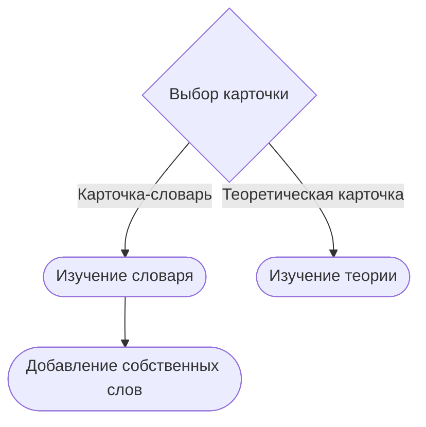

# Проект "Карточки для изучения английского языка"

Данный проект создавался с целью разработки приложения для **изучения английского языка.** Программа будет предоставлять пользователям возможность изучать и **создавать** собственные учебные материалы, делая процесс обучения более доступным и эффективным.

# Что это за программа?

Проект представляет собой программное обеспечение с набором функций, состоящих из восьми тематических кнопок-карточек. *Пять из них* - это таблицы для изучения и ввода новых слов по конкретной теме. Имеется *пустая карточка* для пользователей, добавляющих изученные слова по другим темам. Также есть *две карточки* с учебными изображениями. В процессе проектирования были выбраны сочетающиеся приглушенные цвета, классический шрифт Times New Roman и структурированное размещение элементов для упрощения навигации.

## Зачем она нужна?

Проект может использоваться в качестве **эффективного инструмента** для запоминания новых слов и изучения различных тем. Карточки могут быть использованы как для **самостоятельного изучения языка**, так и в качестве **дополнительного материала** на уроках. Кроме того, они могут быть полезны для подготовки к экзаменам или тестированиям по английскому языку.

## Дальнейшие планы на программу

В дальнейшем развитии проекта имеет смысл добавить возможность *загрузки дополнительных материалов*, таких как:
* обучающих и наглядных изображений 
* таблиц и иных теоретических материалов для изучения английского языка
* расширить функционал создания карточек.

 Пользователи должны иметь возможность создавать свои собственные карточки с изображениями, текстовым содержанием и определенными темами, которые будут размещены на главном окне.
 
## Как это работает?

Взаимодействие пользователя с программой можно визуализировать с помощью [Mermaid](https://mermaidjs.github.io/). Например:

